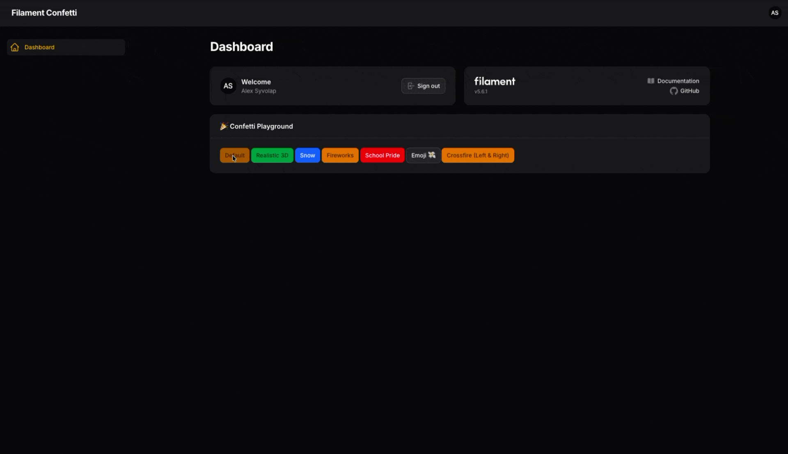
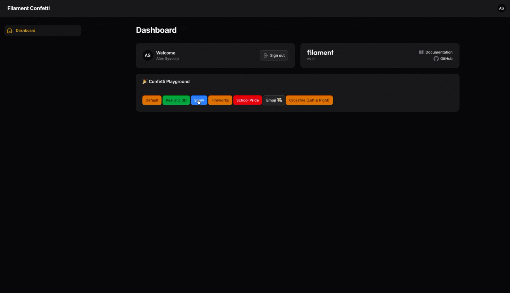
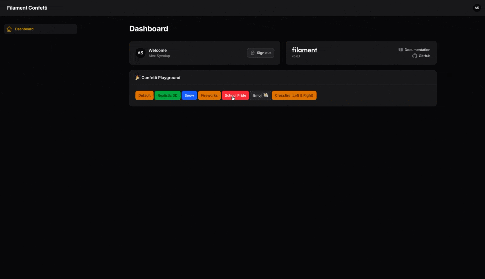
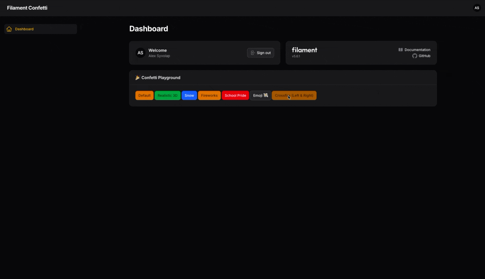
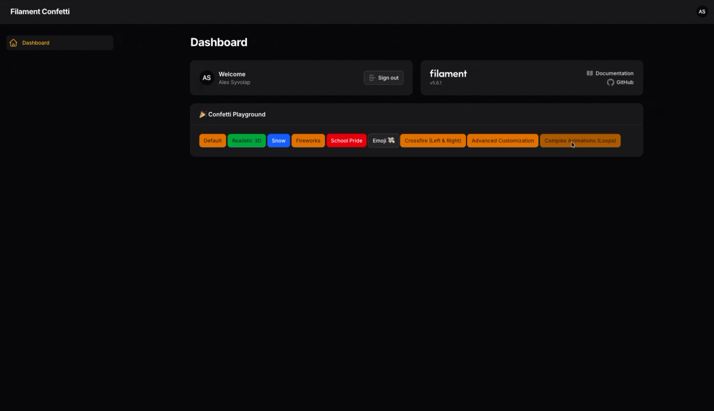

# Filament Confetti 🎉


A fluent, elegant, and zero-config Confetti integration for Filament PHP.
Powered by the amazing [canvas-confetti](https://github.com/catdad/canvas-confetti) library, this package brings
cinematic, hardware-accelerated particle effects to your Filament admin panel with a beautiful PHP Builder API.


## Installation

```bash
composer require alexsyvolap/filament-confetti
```

## Getting Started

### 1. Register the Plugin

```php
use AlexSyvolap\FilamentConfetti\FilamentConfettiPlugin;

public function panel(Panel $panel): Panel
{
    return $panel
        // ...
        ->plugin(FilamentConfettiPlugin::make());
}
```

## Usage

The package provides a highly fluent, chaining API. You can trigger confetti from anywhere in your Filament app (Pages,
Actions, Controllers, Livewire components).

### Basic Usage

Just fire the default confetti explosion from the center of the screen

```php
use AlexSyvolap\FilamentConfetti\Confetti;

Confetti::shoot();
```



### Positioning

You can shoot confetti from various screen positions

```php
Confetti::left()->shoot();
Confetti::topRight()->shoot();
Confetti::bottom()->shoot();
```

Available positions: `center()`, `top()`, `bottom()`, `left()`, `right()`, `topLeft()`, `topRight()`, `bottomLeft()`,
`bottomRight()`.

### Epic Presets 🚀

We ported the most popular cinematic effects so you can use them in one line of code:

#### Realistic Confetti

```php
// Realistic 3D explosion with 5 physical waves
Confetti::realistic()->shoot();
```


#### Show

```php
// 15 seconds of falling snow
Confetti::snow()->shoot();
```



#### Fireworks

```php
// 15 seconds of random fireworks in the sky
Confetti::fireworks()->shoot();
```


#### Emoji

```php
// Raining Emoji explosion!
Confetti::emoji('💸')->shoot();
```


#### School Pride

```php
// School Pride (fires from both bottom corners)
Confetti::colors(['#0057B7', '#FFDD00'])->schoolPride()->shoot();
```



### Multi-Shots (Crossfire)

You can chain multiple cannons together using the `->then()` method:

```php
Confetti::left()->count(150)
    ->then()
    ->right()->count(150)
    ->shoot();
```



### Advanced Customization

You have 100% control over the physics engine. Customize shapes, gravity, colors, and more:

```php
Confetti::center()
    ->count(300)
    ->spread(120)
    ->shapes(['star', 'circle'])
    ->colors(['#ff0000', '#00ff00', '#0000ff'])
    ->startVelocity(100)
    ->decay(0.8) // High friction (stops quickly in the air)
    ->gravity(0.5)
    ->flat(true) // 2D flat paper effect
    ->shoot();
```


### Complex Animations (Loops)

Want to build your own custom timeline of explosions? Use Confetti::make() to retain the instance inside loops:

```php
$confetti = Confetti::make();

for ($delay = 0; $delay < 3000; $delay += 500) {
    $confetti->center()->count(50)->delay($delay)->then();
}

$confetti->shoot();
```



## Testing

```bash
composer test
```

## Contributing

Please see [CONTRIBUTING](.github/CONTRIBUTING.md) for details.

## Security Vulnerabilities

Please review [our security policy](.github/SECURITY.md) on how to report security vulnerabilities.

## Credits

- [Alex Syvolap](https://github.com/alexsyvolap)
- Canvas Confetti by [Kiril Vatev](https://github.com/catdad)

## License

The MIT License (MIT). Please see [License File](LICENSE.md) for more information.
